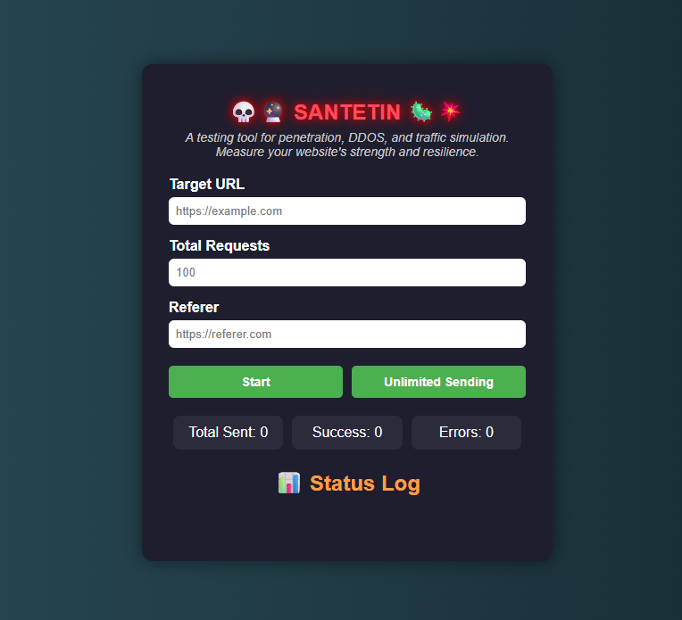

# 💀🔮 Santetin 🦠💥

**Santetin** is a powerful desktop application built with Electron to perform website stress tests, penetration testing simulations, DDOS attacks, and traffic jingling for testing and educational purposes.

> ⚠️ **Disclaimer:** This tool is intended for educational and testing purposes only. Do not use it against any website without explicit permission from the owner.

---
## 🖥️ Screenshot

## 🚀 Features

- **Penetration Testing**: Simulate penetration attempts on your server.
- **DDOS Simulation**: Test your server's stability against simulated DDOS attacks.
- **Traffic Jingling**: Generate massive fake traffic for analytics testing.
- **Random User-Agent**: Each request uses a random User-Agent to simulate real visitors.
- **Custom Referer**: Customize the referer for each request.
- **Progress & Logging UI**: Real-time progress counters and terminal-like log outputs.
- **Unlimited Sending Mode**: Continuously send requests until manually stopped.
- **Cross-platform**: Available for **Windows**, **MacOS**, and **Linux**.

---

## 📦 Download

You can download the latest release here:

👉 **[Download Latest Release](https://github.com/budisantosoku/SANTETIN/releases)**
